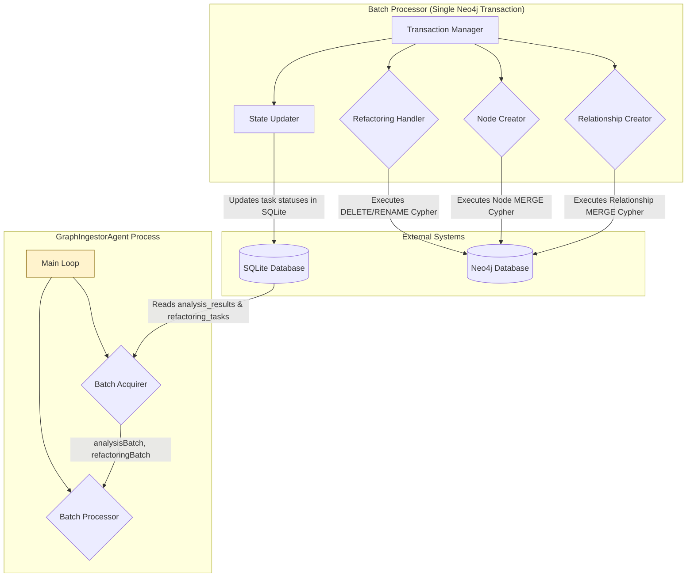

# GraphIngestorAgent -- Component Architecture

## 1. Overview

The `GraphIngestorAgent` is the final service in the pipeline, responsible for deterministically and transactionally building the Neo4j knowledge graph. It operates as a periodic, batch-oriented process. It consumes the validated, structured JSON results, which have been batched into the database by the `ResultCollector` service, and the structural change tasks from the `ScoutAgent`.

Its core design principle is atomicity, ensuring the graph is never left in a partially updated or inconsistent state. This architecture can now leverage the `confidenceScore` added to the analysis results (per ADR-006) to potentially flag low-confidence relationships or build a "shadow graph" for review.

This architecture directly implements the logic from [`docs/specifications/GraphIngestorAgent.md`](../specifications/GraphIngestorAgent.md) and [`docs/pseudocode/GraphIngestorAgent.md`](../pseudocode/GraphIngestorAgent.md).

## 2. Component Diagram

## 3. Component Breakdown

### 3.1. Main Loop

*   **Responsibility**: The entry point and main control flow for the agent.
*   **Logic**:
    1.  Establishes persistent connections to both the SQLite and Neo4j databases.
    2.  Enters an infinite loop.
    3.  Calls the `Batch Acquirer` to fetch all pending work.
    4.  If a batch exists, it passes it to the `Batch Processor`.
    5.  Sleeps for a configured `INGESTOR_INTERVAL_MS` before starting the next cycle.

### 3.2. Batch Acquirer

*   **Responsibility**: To fetch all pending data from SQLite to be processed in the current cycle.
*   **Input**: A database connection.
*   **Output**: An `analysisBatch` (list of analysis results) and a `refactoringBatch` (list of refactoring tasks).
*   **Logic**:
    1.  Queries the `analysis_results` table for all records with status `pending_ingestion`, up to `INGESTOR_BATCH_SIZE`.
    2.  Queries the `refactoring_tasks` table for all records with status `pending`.
    3.  Returns these two lists.

### 3.3. Batch Processor

*   **Responsibility**: To manage the entire lifecycle of processing a single batch within a single, atomic Neo4j transaction.
*   **Input**: The acquired batches and connections to both databases.
*   **Logic**: This component is a direct implementation of the three-pass ingestion strategy.
    1.  **Transaction Manager**: Initiates a transaction with the Neo4j database. It wraps all subsequent steps in a `try/catch` block. On success, it commits the transaction and then calls the `State Updater`. On any failure, it rolls back the transaction, ensuring the graph is unmodified.
    2.  **Refactoring Handler**:
        *   **Purpose**: Handles structural file changes first to prevent conflicts.
        *   **Logic**: Iterates through the `refactoringBatch` and executes Cypher queries for `DELETE` and `RENAME` operations as defined in the pseudocode.
    3.  **Node Creator**:
        *   **Purpose**: Ensures all entities from the analysis results exist as nodes in the graph.
        *   **Logic**: Implements the efficient batch-creation strategy from the pseudocode. It aggregates all entities from the `analysisBatch` by their label (e.g., `:Function`, `:Class`) and executes a single, parameterized `UNWIND ... MERGE` query for each label. This is significantly more performant than creating nodes one by one.
    4.  **Relationship Creator**:
        *   **Purpose**: Connects the nodes that were just created. This pass runs last.
        *   **Logic**: Similar to the `Node Creator`, it aggregates all relationships by type (e.g., `:CALLS`, `:IMPORTS`) and executes a single, batched `UNWIND ... MATCH ... MATCH ... MERGE` query for each relationship type.
    5.  **State Updater**:
        *   **Purpose**: To mark the processed tasks as completed in SQLite so they are not picked up again.
        *   **Logic**: **This is only called after the Neo4j transaction has successfully committed.** It performs bulk `UPDATE` statements on the `analysis_results` and `refactoring_tasks` tables to change their statuses to `ingested` and `completed`, respectively.

## 4. How This Architecture Supports AI-Verifiable Tasks

This architecture is the final step in realizing the "Graph Correctness & Fidelity" acceptance criteria from the [`MasterAcceptanceTestPlan.md`](../tests/MasterAcceptanceTestPlan.md).

*   The **transactional, multi-pass logic** of the `Batch Processor` is what guarantees that the final Neo4j graph is built deterministically.
*   The acceptance tests directly verify the outcome of this agent by querying the Neo4j database and comparing its state (node counts, relationship counts, specific paths) against the "golden" graph. A successful run of this agent is a prerequisite for passing those tests.
*   The **State Updater**'s logic is also critical for the tests, as they assert that all SQLite tasks are moved to their final `completed`/`ingested` state.