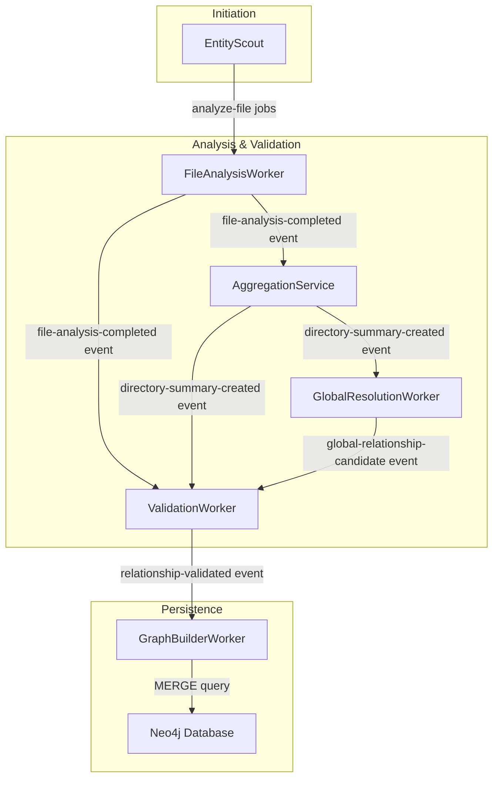

# High-Performance Pipeline Architecture Specification v2.0

## 1. Executive Summary

This document outlines the target architecture for the next generation of the data processing pipeline, designed to resolve the critical performance bottlenecks of the previous version. The chosen architecture is an **Optimized Event-Driven Architecture**, which was selected after a multi-criteria evaluation of three potential paths.

This new design moves away from monolithic, sequential stages to a highly concurrent, event-driven model. It leverages and enhances the existing BullMQ infrastructure to enable maximum parallelism, incremental processing, and near real-time knowledge graph construction, directly addressing the bottlenecks identified in the `Performance_Bottleneck_Analysis_Report.md`.

## 2. Architectural Decision Matrix

The selection of the Optimized Event-Driven Architecture was made through a systematic evaluation based on weighted criteria.

| Criterion                       | Weight | Path 1: Optimized Event-Driven | Path 2: Stream-Processing | Path 3: Stateless Batch |
| ------------------------------- | ------ | ------------------------------ | ------------------------- | ----------------------- |
| **Implementation Complexity**   | 40%    | 4/5 (Low Complexity)           | 1/5 (High Complexity)     | 5/5 (Lowest Complexity) |
| **Robustness**                  | 35%    | 4/5 (High Robustness)          | 5/5 (Highest Robustness)  | 2/5 (Low Robustness)    |
| **Innovation Potential**        | 25%    | 3/5 (Moderate Potential)       | 5/5 (Highest Potential)   | 1/5 (Low Potential)     |
| **Weighted Score**              | 100%   | **3.75**                       | 3.40                      | 2.95                    |

**Justification for Selection:**

The **Optimized Event-Driven Architecture (Path 1)** emerged as the optimal choice with the highest weighted score. It provides the best balance of significantly improved performance and robustness without the overwhelming implementation complexity and operational overhead associated with a full stream-processing migration (Path 2). While the Stateless Batch model (Path 3) is the simplest, its low robustness and lack of real-time capabilities make it unsuitable for the project's long-term goals.

Path 1 directly resolves every identified bottleneck while building upon the existing, familiar technology stack (BullMQ, Redis), ensuring a faster and more manageable implementation.

## 3. Target Architecture Design

The new architecture is composed of independent, event-driven components that communicate through a managed job system.

### 3.1. Core Components

*   **`EntityScout` (Producer):**
    *   **Function:** Scans the target directory and creates a "master flow" job in BullMQ for the entire run.
    *   For each file discovered, it adds an `analyze-file` job as a child of the master flow.
    *   This ensures all file analysis jobs are part of a single, trackable unit.

*   **`FileAnalysisWorker` (Worker):**
    *   **Input:** Consumes `analyze-file` jobs.
    *   **Process:**
        1.  Analyzes the file to find POIs and intra-file relationships.
        2.  Calculates an initial confidence score.
        3.  Publishes its findings as a `file-analysis-completed` event to a Redis Pub/Sub channel or a dedicated "findings" queue. This event contains all POIs and relationships found in that single file.

*   **`AggregationService` (Stateful Service/Worker):**
    *   **Input:** Subscribes to `file-analysis-completed` events.
    *   **Process:**
        1.  Maintains an in-memory state (or uses Redis Hashes) to track the progress of each directory.
        2.  When all files for a given directory have been processed, it triggers the directory-level analysis.
        3.  Constructs a prompt to summarize the directory's purpose based on the aggregated POIs from its constituent files.
        4.  Publishes a `directory-summary-created` event.

*   **`GlobalResolutionWorker` (Worker):**
    *   **Input:** Subscribes to `directory-summary-created` events.
    *   **Process:** As summaries become available, this worker can begin to identify potential inter-directory (global) relationships without waiting for all directories to be processed. It publishes its findings as `global-relationship-candidate` events.

*   **`ValidationWorker` (Worker):**
    *   **Input:** Consumes all finding events (`file-analysis-completed`, `directory-summary-created`, `global-relationship-candidate`).
    *   **Process:** Persists the evidence for each finding and, once all expected evidence for a relationship is gathered, calculates a final confidence score.
    *   If the score is above the threshold, it publishes a `relationship-validated` event.

*   **`GraphBuilderWorker` (Worker / Sink):**
    *   **Input:** Consumes `relationship-validated` events.
    *   **Process:** Upon receiving an event, it executes a small, atomic `MERGE` query in Neo4j to add or update the single validated relationship and its corresponding nodes.
    *   **Outcome:** The knowledge graph is built incrementally and in near real-time as relationships are validated.

### 3.2. Data and Control Flow

### 3.3. How Bottlenecks Are Resolved

1.  **Monolithic GraphBuilder:** Replaced by the `GraphBuilderWorker`, which processes relationships one by one as they are validated. The graph is now built incrementally.
2.  **Bulk Data Loading:** The `GraphBuilderWorker` no longer performs a bulk read. It receives data via events, eliminating the memory-intensive initial query.
3.  **Rigid Staging:** The rigid stages are gone. All workers can operate concurrently, driven by the flow of events. A `GlobalResolutionWorker` can start as soon as the first two related directory summaries are available.
4.  **Directory Aggregation Lock-Step:** The `AggregationService` processes file results as they arrive. While it still waits for all files in a directory to finish before summarizing, the overall system is not blocked. Other directories can be processed and summarized in parallel.
5.  **Sequential Global Pass:** The global pass is no longer a final, monolithic step. The `GlobalResolutionWorker` can work continuously in the background as directory summaries are created.

## 4. Next Steps

The next phase of work will involve breaking down this architectural specification into granular implementation tasks, creating detailed pseudocode for each new or modified component, and defining the test plans necessary to validate the new architecture.