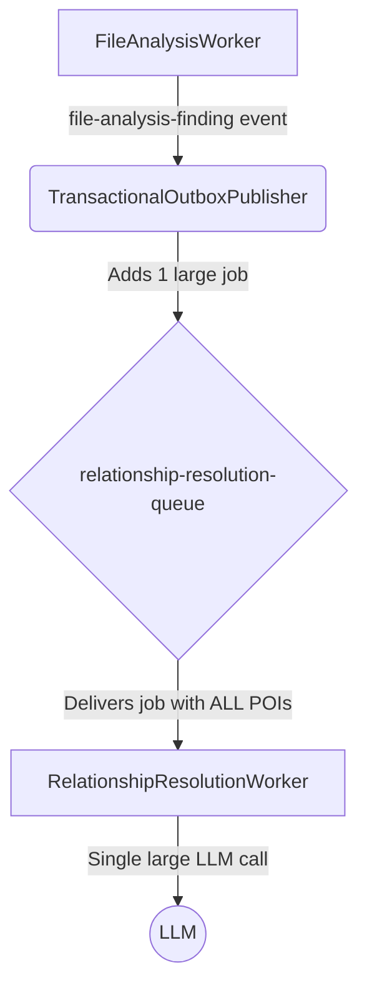
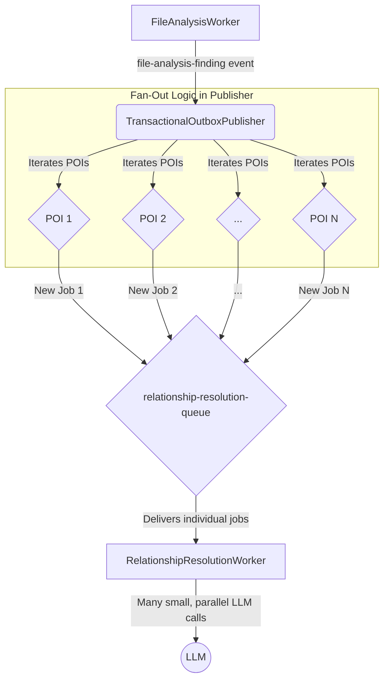

# High-Performance Pipeline Architecture Specification v3.0

## 1. Executive Summary

This document outlines a critical architectural redesign of the data processing pipeline to resolve a severe performance bottleneck. The current system processes all Points of Interest (POIs) from a single file within a monolithic job, leading to unacceptably long processing times.

The new architecture dismantles this monolithic step. It introduces a "fan-out" pattern where the `TransactionalOutboxPublisher` creates a distinct, parallelizable job for **each individual POI**. The `RelationshipResolutionWorker` is re-architected to process these smaller, more focused jobs concurrently. This change shifts the workload from a single, slow, sequential task to many fast, parallel tasks, dramatically improving throughput and reducing the time-to-insight for relationship analysis.

## 2. Architectural Decision Record (ADR)

**Decision--** To parallelize relationship resolution by processing each Point of Interest (POI) as an independent job.

**Status--** Proposed.

**Context--** The `Performance_Bottleneck_Analysis_Report.md` identified that the `RelationshipResolutionWorker` handles all POIs from a file in a single, large LLM call. This is a major bottleneck, as a file with dozens of POIs results in a complex, slow-running job that underutilizes our concurrent worker infrastructure. The system waits for the entire batch to complete before any downstream processing can occur.

**Decision--** We will modify the `TransactionalOutboxPublisher` to iterate through the POIs of a `file-analysis-finding` event and create a separate job for each one. The `RelationshipResolutionWorker` will be adapted to handle these new, single-POI jobs. This moves from a `1-file-to-1-job` model to a `1-file-to-N-jobs` model, where N is the number of POIs in the file.

**Consequences--**
*   **Positive--**
    *   Massive performance improvement through parallelization.
    *   Increased resilience-- a failure in one POI analysis job will not affect others from the same file.
    *   Better scalability, as we can increase `RelationshipResolutionWorker` concurrency to meet demand.
*   **Negative--**
    *   Increased volume of jobs in the `relationship-resolution-queue`. The queue management system (BullMQ/Redis) is well-equipped to handle this.
    *   Requires changes to two core components (`TransactionalOutboxPublisher` and `RelationshipResolutionWorker`).

---

## 3. "Before" Architecture (Current State)

The current workflow is simple but inefficient. A single event leads to a single, large, and slow job.

### 3.1. Data Flow



### 3.2. Component Behavior

*   **`TransactionalOutboxPublisher`--** On receiving a `file-analysis-finding` event, it takes the entire payload (containing an array of all POIs) and enqueues it as a single job.
*   **`RelationshipResolutionWorker`--** It receives a job containing the full list of POIs and constructs one large prompt asking the LLM to find all relationships between all POIs in the list.

---

## 4. "After" Architecture (New Redesign)

The redesigned workflow introduces a fan-out mechanism, creating many small, fast jobs from a single event.

### 4.1. Data Flow



### 4.2. Component Specification

#### 4.2.1. `TransactionalOutboxPublisher.js` Modifications

The publisher's logic for the `file-analysis-finding` event type must be changed.

**Current Logic--**
```javascript
// Simplified for clarity
case 'file-analysis-finding'--
    const payload = JSON.parse(event.payload);
    await queue.add(payload.type, payload);
```

**New Logic--**
```javascript
// Simplified for clarity
case 'file-analysis-finding'--
    const payload = JSON.parse(event.payload);
    const { pois, filePath, runId } = payload;

    if (pois && pois.length > 0) {
        // Create a job for each POI
        for (const primaryPoi of pois) {
            const jobPayload = {
                type-- 'relationship-analysis-poi', // New, more specific type
                source-- 'TransactionalOutboxPublisher',
                jobId-- `poi-${primaryPoi.id}`,
                runId-- runId,
                filePath-- filePath,
                primaryPoi-- primaryPoi,
                contextualPois-- pois.filter(p => p.id !== primaryPoi.id) // All other POIs for context
            };
            await queue.add(jobPayload.type, jobPayload);
        }
    }
```

#### 4.2.2. `relationshipResolutionWorker.js` Modifications

The worker must be adapted to process the new, single-POI job format.

**New Job Payload Structure--**

The worker will now expect a job with this structure--

```json
{
  "type"-- "relationship-analysis-poi",
  "source"-- "TransactionalOutboxPublisher",
  "jobId"-- "poi-some-uuid-1234",
  "runId"-- "run-abc-789",
  "filePath"-- "src/services/someService.js",
  "primaryPoi"-- {
    "id"-- "poi-some-uuid-1234",
    "type"-- "FunctionDefinition",
    "name"-- "calculateTotal"
  },
  "contextualPois"-- [
    {
      "id"-- "poi-other-uuid-5678",
      "type"-- "FunctionDefinition",
      "name"-- "applyDiscount"
    },
    {
      "id"-- "poi-another-uuid-9012",
      "type"-- "Class",
      "name"-- "Invoice"
    }
  ]
}
```

**Prompt Construction (`constructPrompt`) Modification--**

The prompt must be re-framed to be from the perspective of a single POI.

**Current Prompt--**
"Analyze the list of Points of Interest (POIs)... to identify relationships between them."

**New Prompt--**
```javascript
// Inside constructPrompt(filePath, primaryPoi, contextualPois)
const contextualPoiList = contextualPois.map(p => `- ${p.type}-- ${p.name} (id-- ${p.id})`).join('\n');

return `
    Analyze the primary Point of Interest (POI) from the file "${filePath}" to identify its relationships WITH the contextual POIs from the same file.

    Primary POI--
    - ${primaryPoi.type}-- ${primaryPoi.name} (id-- ${primaryPoi.id})

    Contextual POIs--
    ${contextualPoiList}

    Identify relationships where the Primary POI is the source (e.g., it "calls" or "uses" a contextual POI).
    Format the output as a JSON object with a single key "relationships". This key should contain an array of objects where the "from" property is ALWAYS "${primaryPoi.id}".

    Example--
    {
      "relationships"-- [
        {
          "from"-- "${primaryPoi.id}",
          "to"-- "contextual-poi-id-2",
          "type"-- "CALLS",
          "evidence"-- "Function '${primaryPoi.name}' calls function 'beta' on line 42."
        }
      ]
    }

    If no relationships are found, return an empty array.
`;