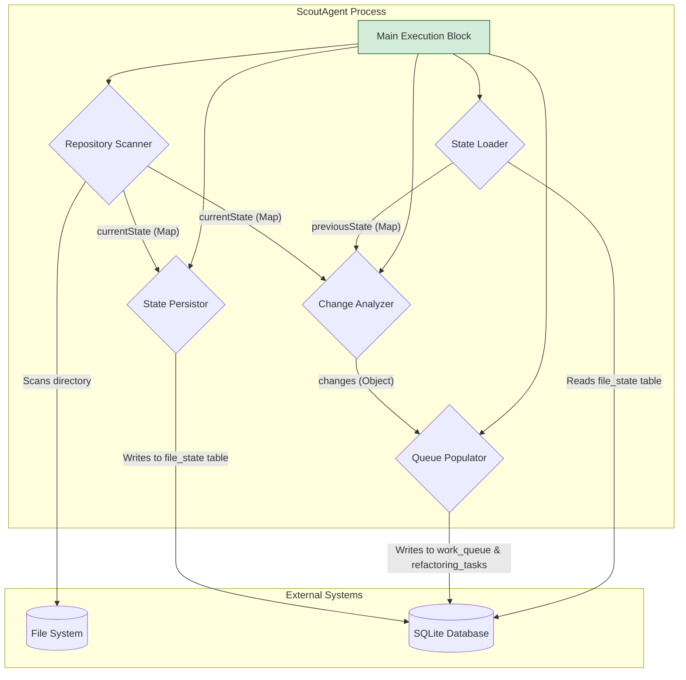

# ScoutAgent -- Component Architecture

## 1. Overview

The `ScoutAgent` is a standalone, stateful service responsible for initiating the code graph pipeline. Its core purpose is to scan a repository, compare its current state against the last known state, and create discrete work items for the downstream agents. It is designed to be run as a single, periodic process.

This architecture directly implements the logic defined in [`docs/specifications/ScoutAgent.md`](../specifications/ScoutAgent.md) and [`docs/pseudocode/ScoutAgent.md`](../pseudocode/ScoutAgent.md).

## 2. Component Diagram

## 3. Component Breakdown

The agent's logic, as outlined in the pseudocode, is implemented through a series of modular components orchestrated by a main execution block.

### 3.1. State Loader

*   **Responsibility**: To load the last known state of the repository from the `file_state` table in the central SQLite database.
*   **Input**: A connection to the SQLite database.
*   **Output**: A `previousState` map of `{ filePath -> contentHash }`.
*   **Logic**:
    1.  Executes a `SELECT file_path, content_hash FROM file_state` query.
    2.  Builds an in-memory map from the results.
    3.  If the table is empty (first run) or an error occurs, it returns an empty map, allowing the process to continue by treating all files as new. This aligns with the resilience requirements.

### 3.2. Repository Scanner

*   **Responsibility**: To perform a full, recursive scan of the target repository directory and generate a snapshot of its current state.
*   **Input**: The root path of the repository and a list of exclusion patterns.
*   **Output**: A `currentState` map of `{ filePath -> contentHash }`.
*   **Logic**:
    1.  Recursively traverses the file system from the root path.
    2.  For each file, it checks if the path matches any of the `EXCLUSION_PATTERNS`.
    3.  If a file is not excluded, it reads the file's content and computes a SHA-256 hash.
    4.  It populates the `currentState` map with the file's relative path and its content hash.
    5.  It logs and skips any files that cannot be read due to permission errors, ensuring the scan is not halted by isolated issues.

### 3.3. Change Analyzer

*   **Responsibility**: To compare the `currentState` and `previousState` maps to produce a definitive list of all changes.
*   **Input**: `currentState` map, `previousState` map.
*   **Output**: A `changes` object containing lists of new, modified, deleted, and renamed files.
*   **Logic**: This component implements the core differentiation logic from the pseudocode:
    1.  **Modified**: Iterates through paths present in both maps and identifies any where the content hash has changed.
    2.  **Renamed**: Implements the smart rename detection. It finds files that were "deleted" from the `previousState` and "added" to the `currentState` that have an identical content hash. This is crucial for preserving node history in the graph.
    3.  **New/Deleted**: After accounting for renames, the remaining added files are marked as `new`, and the remaining removed files are marked as `deleted`.

### 3.4. Queue Populator

*   **Responsibility**: To translate the `changes` object into actionable tasks in the SQLite database.
*   **Input**: The `changes` object and a database connection.
*   **Output**: Records inserted into the `work_queue` and `refactoring_tasks` tables.
*   **Logic**:
    1.  Starts a database transaction.
    2.  For each new and modified file, it inserts a `pending` task into the `work_queue`. It uses `INSERT OR IGNORE` to prevent creating duplicate tasks if a file was already pending from a previous, interrupted run.
    3.  For each deleted file, it inserts a `DELETE` task into `refactoring_tasks`.
    4.  For each renamed file, it inserts a `RENAME` task into `refactoring_tasks`, including both the old and new paths.
    5.  This entire operation is atomic. If any insertion fails, the transaction is rolled back.

### 3.5. State Persistor

*   **Responsibility**: To save the `currentState` map back to the database, making it the `previousState` for the next run.
*   **Input**: The `currentState` map and a database connection.
*   **Output**: An updated `file_state` table in SQLite.
*   **Logic**:
    1.  Within the same transaction as the `Queue Populator`.
    2.  Executes a `DELETE FROM file_state` to completely clear the old state.
    3.  Performs a bulk `INSERT` of all items from the `currentState` map into the `file_state` table.
    4.  Commits the transaction, atomically updating both the work queues and the persistent state.

## 4. How This Architecture Supports AI-Verifiable Tasks

This architecture directly enables the "Initial Repository Processing" and "Incremental Repository Updates" scenarios defined in the [`MasterAcceptanceTestPlan.md`](../tests/MasterAcceptanceTestPlan.md).

*   The **Change Analyzer**'s logic is the foundation for verifying that the correct files are processed during an update.
*   The **Queue Populator** creates the specific `work_queue` and `refactoring_tasks` records that the acceptance tests will assert against to confirm the pipeline's initial state is correct.
*   The **State Persistor** ensures that the outcome of one run correctly sets up the initial conditions for the subsequent run, allowing for deterministic testing of incremental changes.