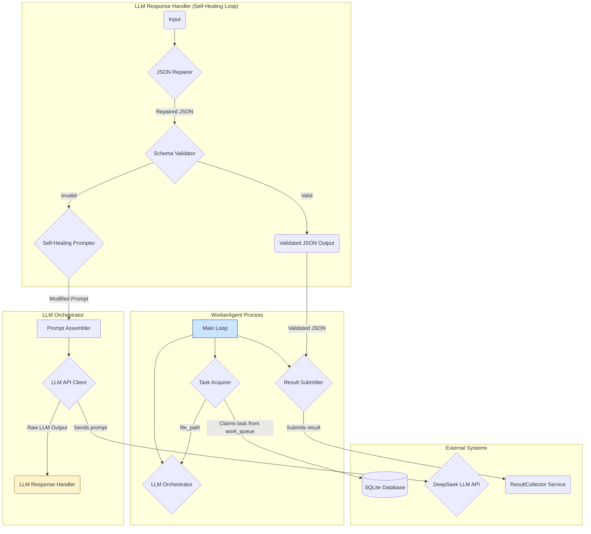

# WorkerAgent -- Component Architecture

## 1. Overview

The `WorkerAgent` is a horizontally-scalable, stateless service that forms the core of the code analysis pipeline. Its sole responsibility is to claim a file analysis task from the work queue, orchestrate the analysis of that file's content by an external Large Language Model (LLM), and pass the structured result onward for ingestion.

This architecture has been specifically revised to address the risks of LLM output instability identified in the **Devil's Advocate Review**. It introduces a robust "LLM Response Handler" to ensure the reliability and validity of the data before it enters the rest of the system. This design directly implements the logic from [`docs/specifications/WorkerAgent.md`](../specifications/WorkerAgent.md) and the resilience patterns from the review.

## 2. Component Diagram

## 3. Component Breakdown

### 3.1. Task Acquirer

*   **Responsibility**: To atomically claim a pending analysis task from the central queue.
*   **Input**: A connection to the SQLite database.
*   **Output**: A `task` object containing the `file_path` and `task_id`.
*   **Logic**:
    1.  Polls the `work_queue` table for a task with `status = 'pending'`.
    2.  Uses an `UPDATE ... SET status = 'claimed' WHERE ... RETURNING ...` query to atomically claim one task, preventing race conditions with other workers.
    3.  If no task is found, it sleeps for a configured interval before retrying.

### 3.2. LLM Orchestrator

*   **Responsibility**: To manage the entire interaction with the LLM, from building the prompt to handling the response. This component contains the critical new resilience logic.
*   **Input**: A `file_path`.
*   **Output**: A validated JSON object conforming to the system's data contract.

#### 3.2.1. Prompt Assembler
*   **Responsibility**: Reads the file content and constructs the precise prompt for the LLM.
*   **Logic**:
    1.  Reads the content of the file from the `file_path`.
    2.  Constructs the prompt using the templates and context defined in the project specifications.
    3.  If a retry is initiated by the `Self-Healing Prompter`, it appends the corrective instructions to the prompt.

#### 3.2.2. LLM API Client
*   **Responsibility**: A simple client to send the request to the DeepSeek LLM API and receive the raw text response.

#### 3.2.3. LLM Response Handler
*   **Responsibility**: This is the core of the new, hardened architecture. It validates, repairs, and retries the LLM interaction in an intelligent loop.
*   **Logic**:
    1.  **JSON Repairer**: The raw LLM output is first passed through a library like `json-repair`. This automatically fixes common syntax errors (e.g., trailing commas, missing brackets), significantly increasing the chances of a successful parse.
    2.  **Schema Validator**: The repaired JSON string is then parsed and validated against a strict JSON Schema definition of the data contract.
    3.  **Success Path**: If validation succeeds, the valid JSON object is returned, and the orchestration is complete.
    4.  **Failure Path (Self-Healing Loop)**: If validation fails, the `Self-Healing Prompter` is invoked. It constructs a new, corrective prompt (e.g., "The previous response was invalid. Please fix it..."), and the `LLM Orchestrator` re-runs the process from the `Prompt Assembler` step. This continues for a configurable number of retries.
    5.  **Terminal Failure**: If all retries fail, the task is marked for submission to the `failed_work` queue.

### 3.3. Result Submitter

*   **Responsibility**: To submit the final, validated result to the appropriate downstream service.
*   **Input**: The validated JSON object from the `LLM Orchestrator`.
*   **Output**: An HTTP request to the `ResultCollector` service.
*   **Logic**:
    1.  Packages the `task_id` and the validated JSON into a payload.
    2.  Sends a `POST` request to the `ResultCollector` service endpoint.
    3.  If the submission fails, it implements its own retry logic before ultimately moving the task to the `failed_work` queue.

## 4. How This Architecture Supports AI-Verifiable Tasks

*   **Error Resilience**: The `LLM Response Handler` and its self-healing loop directly address the "Error Resilience" scenarios in the [`MasterAcceptanceTestPlan.md`](../tests/MasterAcceptanceTestPlan.md). It ensures that transient LLM errors do not cause tasks to fail prematurely.
*   **Graph Correctness**: By enforcing strict schema validation, this architecture is the first line of defense in ensuring the integrity of the data that will eventually be ingested into the graph, supporting the "Graph Correctness & Fidelity" tests.
