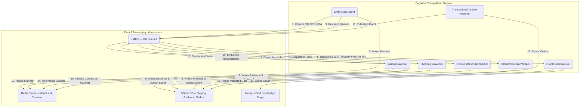

# Cognitive Triangulation v2 -- System Architecture Overview (Revised)

## 1. Introduction

This document outlines the high-level architecture for the Cognitive Triangulation v2 feature. This revised architecture addresses feedback on the initial design to enhance scalability, resilience, and clarity. The v2 system refactors the previous linear analysis pipeline into a robust, event-driven, and multi-pass validation system. The primary goal is to increase the accuracy and reliability of code relationship detection by corroborating findings from multiple, independent analysis contexts before committing them to the knowledge graph.

This design is based on the specifications in [`docs/specifications/cognitive_triangulation/`](../../specifications/cognitive_triangulation/) and the logic defined in [`docs/pseudocode/cognitive_triangulation_v2/`](../../pseudocode/cognitive_triangulation_v2/).

## 2. Architectural Principles (Revised)

-   **Event-Driven--** Components are decoupled and communicate asynchronously via a message queue (BullMQ). This promotes scalability and resilience.
-   **Scalable Validation--** The centralized `ValidationCoordinator` agent is refactored into a horizontally scalable **`ValidationWorker`**, eliminating a potential bottleneck.
-   **Manifest-Guided Reconciliation--** The `EntityScout` agent generates a `runManifest` containing a pre-computed list of *candidate relationships*. This manifest acts as an explicit contract, defining all expected analysis jobs and the evidence they must produce.
-   **Robust Orchestration--** Pipeline finalization is managed reliably using **BullMQ job dependencies**, removing ambiguity and the need for manual state tracking.
-   **Efficient Evidence Handling--** **SQLite** is used for storing large evidence payloads, while **Redis** is used for its strength in fast, atomic operations (coordination counters).
-   **Atomic Operations--** The **Transactional Outbox Pattern** is enforced for all workers to guarantee that data is committed if and only if its corresponding event can be published, preventing data loss.
-   **Auditable Evidence Trail--** The system stores all evidence gathered for each relationship in SQLite, providing a clear audit trail.

## 3. High-Level Component Diagram (C4 Model - Level 2, Revised)

This diagram illustrates the revised components and their interactions.

## 4. Core Workflow (Revised)

1.  **Initiation--** The `EntityScout` agent is invoked. It performs a shallow scan to identify a candidate set of relationships. It generates the `runManifest`, enqueues all analysis jobs in a **paused** state, saves the manifest to Redis, and finally **resumes** the queues.
2.  **Parallel Analysis--** The analysis workers consume jobs from BullMQ. Each worker performs its analysis.
3.  **Atomic Persistence--** In a single transaction, each worker writes its full evidence payload to a `relationship_evidence` table in SQLite and an event message to an `outbox` table.
4.  **Event Publication--** A separate `TransactionalOutboxPublisher` process polls the `outbox` table, publishes the events to BullMQ, and marks them as sent.
5.  **Evidence Coordination--** The `ValidationWorker` consumes these events. For each, it atomically increments a counter in Redis (`evidence_count:{runId}:{hash}`).
6.  **Reconciliation Trigger--** The `ValidationWorker` compares the counter to the expected count from the `runManifest`. If they match, it enqueues a job to reconcile the relationship, which involves reading the full evidence from SQLite.
7.  **Graph Generation--** The `EntityScout` also creates a final `GraphBuilderWorker` job that depends on all other analysis jobs. Once all analysis is complete, BullMQ automatically enqueues this job. The `GraphBuilderWorker` reads `VALIDATED` data from SQLite to build the final knowledge graph in Neo4j.