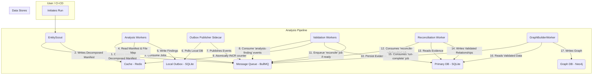

# Cognitive Triangulation v2 - System Overview (Revised)

## 1. Introduction

The Cognitive Triangulation v2 system is a distributed, event-driven analysis pipeline designed to build a knowledge graph of a target codebase. It identifies points of interest (POIs) and their relationships.

This revised architecture implements a **decentralized, data-driven validation model** and a **stateless worker pattern** to achieve superior scalability, resilience, and performance. The system is robust against transient failures and processes large codebases efficiently through parallel processing and optimized data storage.

## 2. Core Principles

-   **Asynchronous & Event-Driven--** Components communicate through a message queue, ensuring loose coupling.
-   **Parallel Processing--** Analysis is broken into small, independent jobs that are executed in parallel by multiple stateless workers.
-   **Resilience--** The transactional outbox pattern, combined with idempotent workers, guarantees reliable event delivery and prevents data corruption.
-   **Dynamic Discovery--** A manifest of expected evidence is built dynamically in Redis using high-performance, native data structures.
-   **Stateless, Data-Driven Validation--** State is managed in resilient data stores (Redis for counters, SQLite for payloads), not in application memory. Validation logic is handled by horizontally scalable, stateless workers.

## 3. High-Level Architecture (C4 Model - Level 1, Revised)

The diagram below illustrates the main containers and their revised interactions, highlighting the stateless validation flow.

### Component Summary (Revised)

-   **EntityScout--** The entry point. Scans the filesystem, creates jobs, and seeds the **decomposed run manifest** in Redis, including the critical `file_to_job_map`.
-   **Analysis Workers (`FileAnalysisWorker`, etc.)--** Stateless workers that consume jobs. They use an LLM for analysis, query Redis for manifest data, and write findings to a **local transactional outbox database**.
-   **TransactionalOutboxPublisher (Sidecar)--** A sidecar process running on each compute node. It polls its **local SQLite database file** and reliably publishes events to the message queue.
-   **ValidationWorker--** A stateless, scalable worker that consumes `analysis-finding` events. It **persists the evidence payload to a central `relationship_evidence` table** and **atomically increments a counter in Redis**. If the count is met, it enqueues a `reconcile-relationship` job.
-   **ReconciliationWorker--** A stateless worker that processes `reconcile-relationship` jobs. It fetches all persisted evidence for a relationship, calculates a confidence score, and saves the final validated record to the primary database.
-   **GraphBuilderWorker--** The final stage. Reads validated relationships from the primary DB and constructs the knowledge graph in Neo4j.
-   **Message Queue (BullMQ)--** Orchestrates job distribution and event-driven communication.
-   **Cache (Redis)--** Stores the **decomposed run manifest** using native data types (Hashes, Sets) and atomic counters for evidence tracking.
-   **Primary DB (SQLite)--** Holds the `outbox` tables (on local nodes), the central `relationship_evidence` table, and the final `relationships` table.
-   **Graph DB (Neo4j)--** The final destination for the knowledge graph.