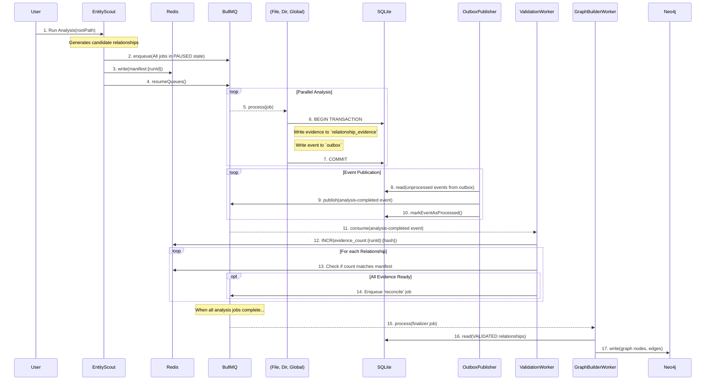
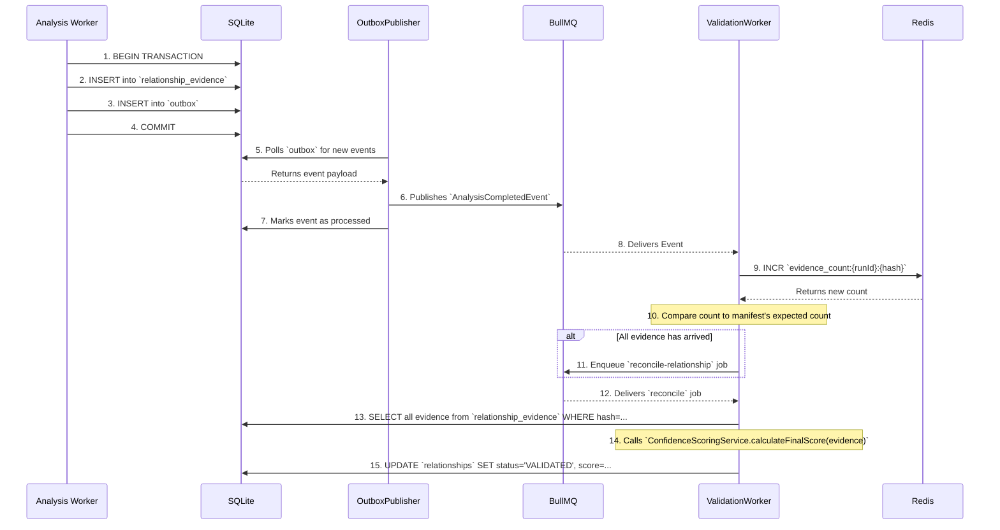

# Cognitive Triangulation v2 -- Data Flow & Interactions (Revised)

This document details the revised data flow and key interaction patterns within the Cognitive Triangulation v2 system. The new flow enhances resilience and scalability by incorporating job-dependency orchestration, the transactional outbox pattern, and a more efficient evidence handling strategy.

## 1. Overall Data Flow Diagram (Revised)

This diagram provides a comprehensive view of the entire process, reflecting the architectural changes.

## 2. Key Interaction-- Atomic Evidence Handling & Validation

This sequence diagram focuses on the core validation loop, highlighting the transactional outbox pattern and the revised use of Redis and SQLite.

**Context:** The `runManifest` is in Redis, and analysis queues are active.

### Explanation of the Revised Interaction

1.  **Guaranteed Manifest Availability:** `EntityScout` now enqueues all jobs in a **paused** state and only resumes the queues *after* the manifest has been successfully written to Redis. This completely eliminates the race condition where a worker might start before its contract is defined.
2.  **Transactional Outbox for Atomicity:** Workers no longer publish directly to the message queue. Instead, they write their evidence and the event payload to two separate tables (`relationship_evidence` and `outbox`) within a **single database transaction**. This guarantees that an event is never lost if the worker crashes after writing its data but before publishing.
3.  **Decoupled Event Publication:** A simple, robust `OutboxPublisher` process handles the critical task of moving events from the database to the message queue, ensuring reliability.
4.  **Efficient Evidence Storage:** Large evidence payloads are written directly to SQLite, a database optimized for such storage.
5.  **Coordination via Atomic Counters:** Redis is now used for its primary strength-- fast, atomic operations. The `ValidationWorker` simply increments a counter for each piece of evidence received. This is a low-memory, high-performance way to track progress.
6.  **Dependency-Managed Finalization:** The `GraphBuilderWorker` is now triggered automatically by BullMQ when all its dependent analysis jobs complete successfully. This is a much more robust and less error-prone mechanism than having a coordinator agent manually track job completion.