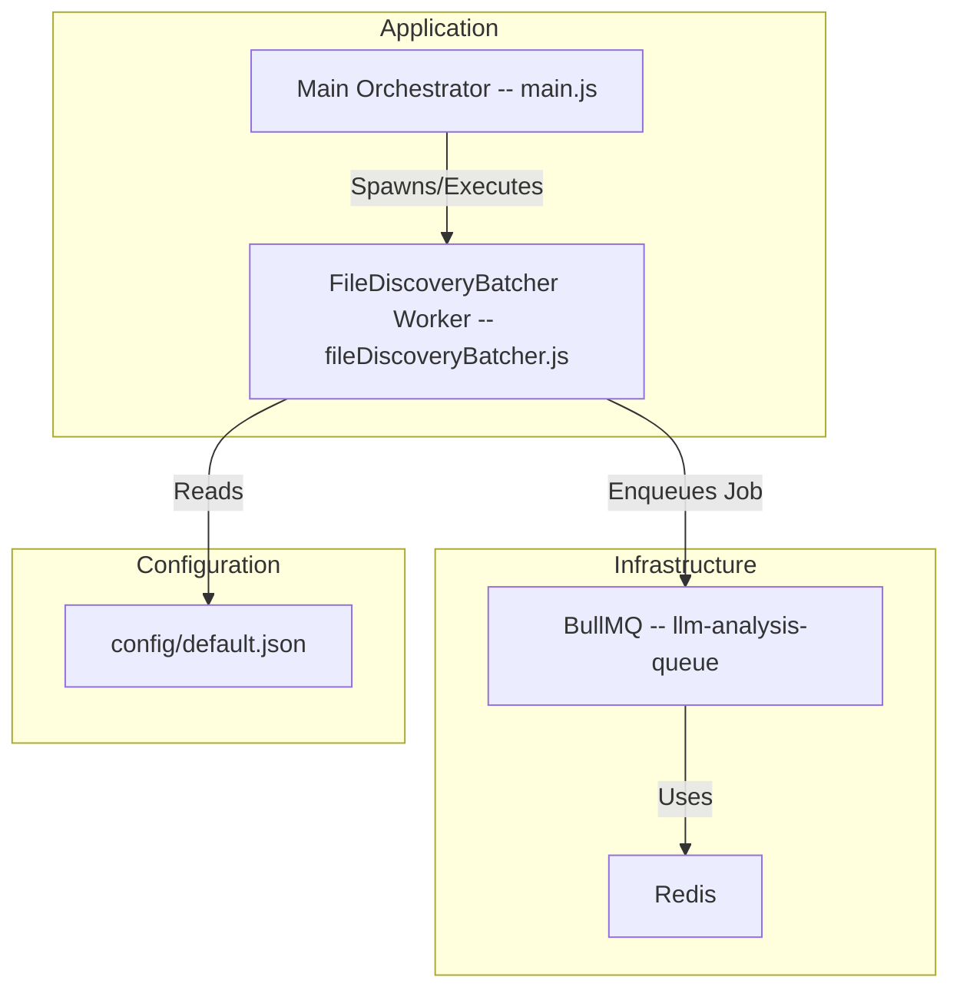

# Architecture-- Sprint 1 - Core Infrastructure & Batching

**Version--** 1.0
**Date--** 2025-06-27
**Status--** Initial Draft

## 1. Overview

This document outlines the architectural design for Sprint 1 of the "High-Performance Pipeline V2" project. The focus of this sprint is to establish the foundational components of the system, including a robust queuing mechanism and the first worker, the `FileDiscoveryBatcher`.

This design directly supports the goals laid out in the [`primary_project_planning_document_llm_pipeline_v2.md`](../../primary_project_planning_document_llm_pipeline_v2.md:1) and implements the logic defined in the [`FileDiscoveryBatcher_spec.md`](../../specifications/high_performance_llm_only_pipeline/01_FileDiscoveryBatcher_spec.md:1) and its corresponding [`FileDiscoveryBatcher_pseudocode.md`](../../pseudocode/high_performance_llm_only_pipeline/FileDiscoveryBatcher_pseudocode.md:1).

## 2. Directory Structure

A logical and scalable directory structure is crucial for maintainability. The following structure will be adopted for the new components--

```
.
├── config/
│   └── default.json             -- Centralized configuration (Redis, paths, etc.)
├── src/
│   ├── workers/
│   │   └── fileDiscoveryBatcher.js  -- The main script for the batcher worker.
│   ├── utils/
│   │   └── queueManager.js          -- Centralized BullMQ management utility.
│   └── main.js                    -- Main application entry point/orchestrator.
└── tests/
    ├── functional/
    │   └── sprint1/
    │       └── fileDiscoveryBatcher.test.js -- Integration tests for the batcher.
    └── test-data/
        └── sample_project/          -- A sample directory of code for testing.
```

## 3. Component Diagram

The following diagram illustrates the high-level components and their interactions within the scope of Sprint 1.



## 4. Data Flow Diagram

This sequence diagram details the flow of operations when the `FileDiscoveryBatcher` is executed.

```mermaid
sequenceDiagram
    participant MainOrchestrator
    participant FileDiscoveryBatcher
    participant FileSystem
    participant QueueManager
    participant BullMQ

    MainOrchestrator->>+FileDiscoveryBatcher-- Activate Worker
    FileDiscoveryBatcher->>+FileSystem-- Scan for files (using glob patterns)
    FileSystem-->>-FileDiscoveryBatcher-- Return file paths
    FileDiscoveryBatcher->>FileDiscoveryBatcher-- Read files, count tokens, create batches
    loop For each batch created
        FileDiscoveryBatcher->>+QueueManager-- Add 'FileBatch' Job
        QueueManager->>+BullMQ-- Enqueue Job in 'llm-analysis-queue'
        BullMQ-->>-QueueManager-- Job Added
        QueueManager-->>-FileDiscoveryBatcher-- Confirmation
    end
    FileDiscoveryBatcher-->>-MainOrchestrator-- Worker Finished
```

## 5. Implementation Plan

### 5.1. Queue Management

The `utils/queueManager.js` will serve as a singleton or a centralized factory for accessing BullMQ `Queue` and `Worker` instances. This approach prevents redundant Redis connections and ensures consistent configuration across the application.

*   **Structure:** It will export functions like `getQueue(queueName)` and `closeConnections()`.
*   **Configuration:** It will read Redis connection details from the centralized `config/default.json` file.
*   **Testability:** By reading connection details from a config file, tests can easily point the `QueueManager` to a separate, live Redis instance (e.g., a different database index or a containerized instance) for the test environment, fulfilling **Task 1.1.1**'s verification criteria without mocking.

### 5.2. `FileDiscoveryBatcher` Implementation

The `FileDiscoveryBatcher` will be implemented as a standalone Node.js script in `src/workers/fileDiscoveryBatcher.js`. It can be executed directly (`node src/workers/fileDiscoveryBatcher.js`) or spawned as a child process or `worker_thread` by a main orchestrator script.

*   **Dependencies:**
    *   It will import and use the `queueManager` to get an instance of the `llm-analysis-queue`.
    *   It will use `@huggingface/tokenizers` for token counting, as specified in [`01_FileDiscoveryBatcher_spec.md`](../../specifications/high_performance_llm_only_pipeline/01_FileDiscoveryBatcher_spec.md:1).
    *   It will use `fast-glob` for file discovery.
*   **Execution:** The script will contain the logic from the `FileDiscoveryBatcher` class pseudocode. Upon execution, it will initialize, run the discovery and batching process, enqueue the jobs, and then exit. This design makes it a discrete, testable, and runnable unit of work.

### 5.3. Configuration

All configuration will be centralized in `config/default.json`. This includes--
*   Redis connection details (`host`, `port`).
*   File discovery parameters (`targetDirectory`, `globPatterns`).
*   Batching parameters (`maxTokensPerBatch`, `promptOverhead`).

This centralization simplifies management and allows for easy overrides for different environments (e.g., development, testing, production) using environment-specific files or environment variables.

## 6. Testability & The "No-Mocking" Policy

This architecture is designed from the ground up to be testable against live infrastructure, directly addressing the "no-mocking" policy and supporting the AI-verifiable tasks in the planning document.

*   **Filesystem Testing:** The `FileDiscoveryBatcher`'s `targetDirectory` is configurable. Functional tests will point it to a dedicated directory within `tests/test-data/` containing a curated set of sample source files. The tests can then assert that the correct files are discovered and batched.
*   **Queue Testing:** As described in the `QueueManager` section, tests will configure it to connect to a live, but isolated, Redis instance.
*   **Integrated Testing (`Task 1.3.1`):** A functional test for the `FileDiscoveryBatcher` will--
    1.  Clear the test Redis queue.
    2.  Execute the `fileDiscoveryBatcher.js` worker script, pointing it to the test data directory and test Redis instance.
    3.  Once the worker completes, the test will connect to the same Redis instance.
    4.  It will fetch jobs from the `llm-analysis-queue`.
    5.  It will then assert that the enqueued jobs match the expected `FileBatch` structure and content, as defined in [`04_Job_Data_Models_spec.md`](../../specifications/high_performance_llm_only_pipeline/04_Job_Data_Models_spec.md:1).

This approach validates the entire workflow of the worker—from filesystem interaction to queue production—in an integrated, realistic manner without a single mock.