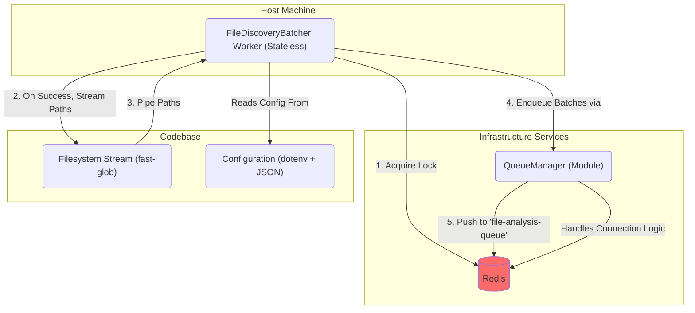

# High-Performance Pipeline V2 - Sprint 1 Architecture (Revised)

**Version--** 2.0
**Date--** 2025-06-27
**Status--** Proposed
**Author--** Architect Mode

## 1. Overview

This document outlines the revised architecture for the core infrastructure of the High-Performance Pipeline V2. This design supersedes the previous version and directly addresses the critical flaws identified in the Devil's Advocate critique ([`docs/devil/critique_report_sprint_1_architecture.md`](../../devil/critique_report_sprint_1_architecture.md)).

The primary goal of this architecture is to establish a **robust, scalable, and secure foundation** for file discovery, batching, and job queuing. It prioritizes resilience and horizontal scalability by default, correcting the "happy path" bias of the initial design.

## 2. Core Principles (Revised)

*   **Robustness over Simplicity--** All components are designed with failure in mind. This includes connection retries, dead-letter queues, and graceful error handling within data streams.
*   **Scalability by Design--** The system must support multiple concurrent worker instances without causing data duplication or race conditions.
*   **Stateless Producers--** Producers (job creators) should be stateless. Idempotency is the responsibility of downstream consumers, preventing data loss or duplication if a producer fails.
*   **Secure by Default--** Sensitive configuration, such as passwords and API keys, must never be stored in version control.

## 3. Component Architecture (C2)

This diagram shows the key components and their interactions, incorporating the revised architectural principles.



### Component Responsibilities--

*   **FileDiscoveryBatcher Worker--** A standalone, stateless Node.js process. Its sole responsibility is to scan a target directory, create batches of files based on token count, and enqueue them as jobs. It is designed to be run as a scalable, containerized service.
*   **QueueManager--** A shared module responsible for all interactions with Redis queues. It now encapsulates robust connection logic and a dead-letter queue (DLQ) strategy.
*   **Redis--** Acts as both the message broker for BullMQ and the backend for a distributed locking mechanism.
*   **Filesystem Stream--** Uses `fast-glob`'s streaming API to discover file paths without loading the entire list into memory.
*   **Configuration--** A hybrid system using `dotenv` for secrets and a JSON file for non-sensitive defaults.

## 4. Data Flow Diagram (Revised)

This diagram illustrates the revised, scalable, and robust data flow for creating file batch jobs.

```mermaid
sequenceDiagram
    participant Worker1 as FileDiscoveryBatcher Worker 1
    participant Worker2 as FileDiscoveryBatcher Worker 2
    participant Redis
    participant Filesystem

    Note over Worker1, Worker2-- Multiple workers start concurrently for the same directory.

    Worker1 ->>+ Redis-- SETNX lock 'discovery:path/to/dir'
    Redis -->>- Worker1-- OK (Lock Acquired)

    Worker2 ->>+ Redis-- SETNX lock 'discovery:path/to/dir'
    Redis -->>- Worker2-- FAIL (Lock Held)
    Note over Worker2-- Exits gracefully.

    Note over Worker1-- Begins processing...
    Worker1 ->>+ Filesystem-- Start streaming file paths (fast-glob)
    Filesystem -->>- Worker1-- pipe(filePath1)
    Worker1 ->> Worker1-- try { read file } catch { log error }
    Filesystem -->>- Worker1-- pipe(filePath2)
    Worker1 ->> Worker1-- try { read file } catch { log error }
    Note over Worker1-- Batches are created as the stream progresses.

    Worker1 ->>+ Redis-- RPUSH file-analysis-queue '{"batchId": "...", "files": [...] }'

    Note over Worker1-- Continues until stream ends.
    Worker1 ->>+ Redis-- DEL lock 'discovery:path/to/dir'
    Redis -->>- Worker1-- OK (Lock Released)

```

## 5. Architectural Decisions & Revisions

### 5.1. Robustness and Error Handling

*   **Redis Connection Strategy--**
    *   **Decision--** The `QueueManager` will be configured to handle Redis connection failures automatically.
    *   **Implementation--** It will use exponential backoff for connection retries, preventing a worker from crashing if Redis is temporarily unavailable during startup. This is a built-in feature of production-ready clients like `ioredis`, which underpins BullMQ.

*   **Dead-Letter Queue (DLQ) Strategy--**
    *   **Decision--** A global DLQ strategy will be implemented for all queues managed by `QueueManager`.
    *   **Implementation--** Jobs that fail a configurable number of times (e.g., 3 attempts) will be automatically moved by BullMQ to a dedicated `failed-jobs` queue. This prevents poison-pill messages and allows for manual inspection and reprocessing.

*   **Filesystem Error Handling--**
    *   **Decision--** A single problematic file must not crash the entire batching process.
    *   **Implementation--** Within the streaming pipeline, each file-read and token-counting operation will be wrapped in an individual `try...catch` block. If a file is unreadable (e.g., permissions error, deleted post-discovery), the error will be logged, and the file will be skipped. The worker will continue processing the rest of the stream.

*   **Idempotency--**
    *   **Decision--** The `FileDiscoveryBatcher` producer will be fundamentally stateless.
    *   **Implementation--** The worker will not track its own progress. It is designed to run, create jobs, and exit. Responsibility for idempotency is shifted to downstream consumers. Consumers (e.g., `FileAnalysisWorker`) **must** check if a `batchId` has already been processed before starting work. This makes the system resilient to producer restarts or crashes.

### 5.2. Scalability

*   **Distributed Locking--**
    *   **Decision--** To prevent job duplication when running multiple `FileDiscoveryBatcher` instances, a distributed lock must be acquired before a directory scan begins.
    *   **Implementation--** Before scanning, the worker will attempt to acquire a lock in Redis for the target directory using a `SETNX` (SET if Not eXists) command with a reasonable TTL (e.g., 10 minutes). If the lock is acquired, the worker proceeds. If not, it indicates another worker is already processing that directory, and the current worker will log a message and exit gracefully. The lock is released upon successful completion or expires after the TTL.

*   **Streaming Pipeline for File Processing--**
    *   **Decision--** The previous design's in-memory accumulation of file paths is a critical scalability bottleneck. The process must be refactored into a memory-efficient stream.
    *   **Implementation--** The `fast-glob` stream API will be used to discover files. This stream of file paths will be piped directly into a Node.js `Transform` stream. This transform stream will be responsible for reading file contents, counting tokens, and assembling batches on the fly, emitting a `FileBatch` object only when a batch is full. This ensures that memory usage remains low and constant, regardless of the number of files in the target directory.

### 5.3. Configuration and Security

*   **Secure Configuration Management--**
    *   **Decision--** Secrets must not be stored in version control.
    *   **Implementation--** The application will use the `dotenv` library to load secrets from a `.env` file during local development. In production environments (e.g., Docker, Kubernetes), these same variables will be injected directly as environment variables. The `config/default.json` file will be used **only** for non-sensitive data, such as queue names, default batch sizes, or public API endpoints.

### 5.4. Testing Strategy (Revised)

*   **Decision--** The "no-mocking" policy is officially **rescinded** for the V2 pipeline. We will adopt a standard Testing Pyramid model to ensure both correctness and the ability to test failure modes in isolation. This aligns with the V2 project planning documents.
*   **Implementation-- The Testing Pyramid--**
    *   **Unit Tests (Fast & Isolated)--**
        *   **Scope--** Test individual modules and functions in isolation.
        *   **Mocks--** Use mocking libraries (e.g., Jest mocks) extensively to simulate dependencies like Redis, filesystem operations, and LLM clients.
        *   **Purpose--** Verify business logic and, critically, test specific edge cases and error handling (e.g., "what happens if Redis throws a connection error?", "what happens if a file is unreadable?"). These are difficult or impossible to test reliably in an integration environment.
    *   **Integration Tests (Slower & Collaborative)--**
        *   **Scope--** Test the interaction between two or more live components.
        *   **Mocks--** Minimal to no mocking. Tests will run against live services (e.g., a local Redis instance, a real filesystem).
        *   **Purpose--** Verify the "happy path" and ensure components are configured correctly to communicate with each other (e.g., "can the `FileDiscoveryBatcher` successfully connect to Redis and enqueue a valid job?").
    *   **End-to-End (E2E) Tests (Slowest & Comprehensive)--**
        *   **Scope--** Test the entire pipeline from start to finish.
        *   **Purpose--** To be developed in later sprints, these will validate the full business flow from file discovery to final graph ingestion.