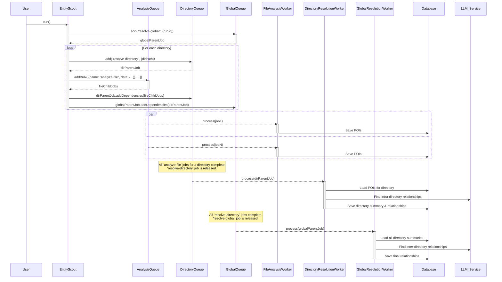

# Data Flow and Job Lifecycle (Revised)

**Parent Document:** [System Architecture](./system_overview.md)
**Status:** In Design

## 1. Overview

This document provides a detailed, step-by-step breakdown of the revised hierarchical data and control flow. It illustrates the multi-level parent-child job dependencies that prevent bottlenecks and enable greater scalability.

## 2. Sequence Diagram (Hierarchical)

## 3. Job Lifecycle and State Transitions

The lifecycle of an individual job (`waiting`, `active`, `completed`, `failed`) remains the same as the original design. The key change is the introduction of a multi-level dependency chain.

-   **`analyze-file` (Child Job):** Dependent on nothing. Its completion releases a dependency on its parent.
-   **`resolve-directory` (Intermediate Parent Job):** State is `waiting-children` until all its dependent `analyze-file` jobs are `completed`. Its completion releases a dependency on the global parent job.
-   **`resolve-global` (Root Parent Job):** State is `waiting-children` until all its dependent `resolve-directory` jobs are `completed`. Its completion marks the end of the entire analysis run.

---

## 4. Navigation

-   [Back to System Overview](./system_overview.md)