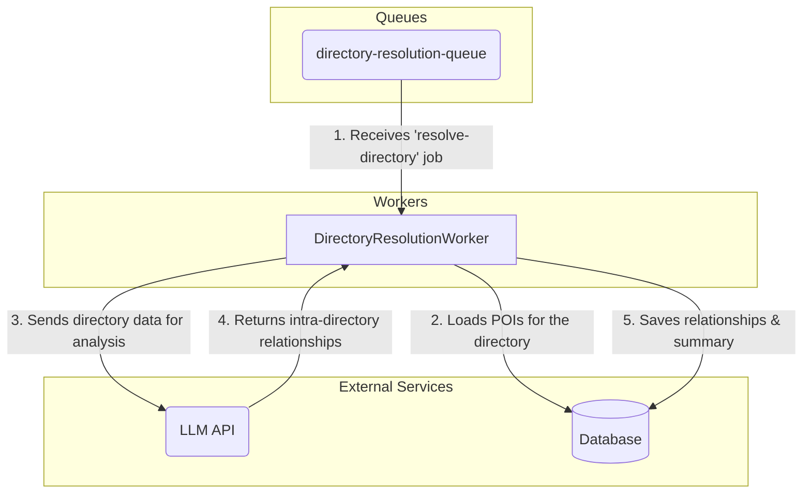

# Component Architecture-- DirectoryResolutionWorker (New)

**Parent Document:** [System Architecture](./system_overview.md)
**Status:** In Design

## 1. Component Purpose (C3)

The `DirectoryResolutionWorker` is the **Stage 1** analysis consumer in the revised hierarchical model. It is triggered by a `resolve-directory` job, which is released only after all `analyze-file` jobs for a specific directory are complete. Its purpose is to find all relationships *internal* to that directory, creating a localized "directory summary" without needing knowledge of the entire project.

## 2. Key Responsibilities

-   **Job Consumption:** Listens to the `directory-resolution-queue` for `resolve-directory` jobs.
-   **Scoped Data Aggregation:** Loads all POIs for the single directory specified in the job payload.
-   **Intra-Directory Analysis:** Constructs a prompt with the directory-specific POIs and queries an LLM to find relationships between them.
-   **Context Budgeting:** Chunks the POI data if it exceeds the LLM context budget.
-   **Data Persistence:** Saves the discovered intra-directory relationships and a summary document to the database.

## 3. Component Diagram & Interactions

## 4. Key Functions

### `constructor()`
-   **Pseudocode Logic:**
    -   Calls `QueueManager.createWorker()` to listen to the `'directory-resolution-queue'`.
-   **Architectural Significance:** A standard, horizontally scalable worker.

### `processJob(job)`
-   **Pseudocode Logic:**
    1.  Validates the job payload for a `directoryPath`.
    2.  Starts a database transaction.
    3.  Loads all POIs where `filePath` is within the `directoryPath`.
    4.  Calls `_resolveRelationships()` with the scoped POIs.
    5.  Calls `_saveResults()` to persist the relationships and a summary.
    6.  Commits or rolls back the transaction.
-   **Architectural Significance:** This is the core of the Stage 1 fan-in. It creates an intermediate analysis product (the directory summary) that is crucial for the next stage, preventing a single, massive bottleneck.

### `_resolveRelationships(pois)`
-   **Pseudocode Logic:**
    -   Aggregates POIs into a prompt.
    -   Implements context budgeting, chunking the POIs into multiple LLM calls if necessary.
    -   Queries the LLM to find relationships *only* within the provided context.
    -   Returns the structured relationship data.
-   **Architectural Significance:** By strictly limiting the scope of analysis, this function ensures that memory usage and LLM context size remain bounded and manageable, directly solving the primary bottleneck identified in the critique.

---

## 5. Navigation

-   [Back to System Overview](./system_overview.md)