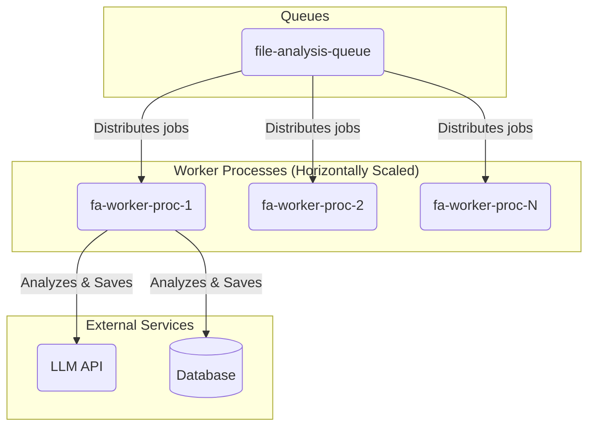

# Component Architecture-- FileAnalysisWorker (Revised)

**Parent Document:** [System Architecture](./system_overview.md)
**Status:** In Design

## 1. Component Purpose (C3)

The `FileAnalysisWorker` is a dedicated **consumer** that processes `analyze-file` jobs. Each worker instance is an independent, stateless process **designed to be scaled horizontally using a process manager (e.g., PM2, Kubernetes).** Its primary function is to perform a deep analysis of a single source code file, identify Points of Interest (POIs), and persist these findings atomically.

## 2. Key Responsibilities

-   **Job Consumption:** Listens to the `file-analysis-queue`.
-   **File I/O:** Reads file content.
-   **LLM-based Analysis:** Queries an LLM to extract POIs. **This now includes a "context budget" to handle very large files.**
-   **Data Persistence:** Saves results to the database within a transaction.
-   **Scaling:** The system is scaled by running more instances of the worker process, not by adjusting an internal concurrency setting.

## 3. Component Diagram & Interactions

## 4. Key Functions (Revised)

### `constructor()`
-   **Pseudocode Logic:**
    -   The constructor no longer accepts a `concurrency` setting. It is assumed each process runs a worker with a small, fixed concurrency (e.g., 2-4) managed by BullMQ.
    -   Calls `QueueManager.createWorker()` to set up the listener on the `'file-analysis-queue'`, passing its `processJob` method.
-   **Architectural Significance:** This change solidifies the move to a standard, process-based horizontal scaling model. It simplifies the worker's own logic and delegates scaling orchestration to the runtime environment.

### `processJob(job)`
-   **Pseudocode Logic:**
    -   The core transactional logic remains the same-- `BEGIN`, `_analyzeFileContent`, `_saveResults`, `COMMIT`/`ROLLBACK`.
-   **Architectural Significance:** The atomicity of file processing remains a cornerstone of the system's data integrity.

### `_analyzeFileContent(filePath, fileContent)`
-   **Pseudocode Logic:**
    -   **Context Budgeting:** Before querying the LLM, it checks the token count of the `fileContent`.
    -   If the count exceeds a predefined "context budget" (e.g., 90,000 tokens), it splits the content into multiple chunks.
    -   It then sends each chunk to the LLM in a separate, sequential call.
    -   It aggregates the POI results from all chunks into a single list.
    -   Sanitizes and validates the final aggregated JSON response.
-   **Architectural Significance:** This directly addresses the "Unbounded Resource Consumption" critique. It prevents deterministic failures on large files and makes LLM costs more predictable by placing an upper bound on the size of any single request.

### `_saveResults(analysisResults, transaction)`
-   No significant changes. This function remains a clean, reusable data access component operating within the caller's transaction.

---

## 5. Navigation

-   [Back to System Overview](./system_overview.md)