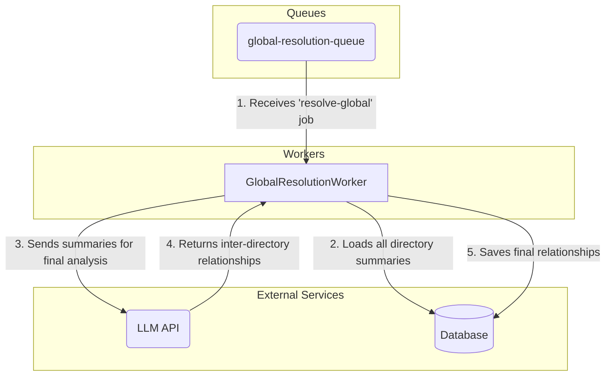

# Component Architecture-- GlobalResolutionWorker (New)

**Parent Document:** [System Architecture](./system_overview.md)
**Status:** In Design

## 1. Component Purpose (C3)

The `GlobalResolutionWorker` is the **Stage 2** and final consumer in the analysis pipeline. It is triggered by a single `resolve-global` job, which is released only after all `resolve-directory` jobs for the entire run are complete. Its purpose is to synthesize the high-level summaries from each directory to discover the final, inter-directory relationships across the whole project.

## 2. Key Responsibilities

-   **Job Consumption:** Listens to the `global-resolution-queue` for the single `resolve-global` job.
-   **Summary Aggregation:** Loads all the *directory summary documents* generated by the `DirectoryResolutionWorker` stage. It does **not** load the raw POIs.
-   **Inter-Directory Analysis:** Constructs a prompt from the aggregated summaries and queries an LLM to find the final, high-level relationships connecting the different directories.
-   **Data Persistence:** Saves the final inter-directory relationships to the database.

## 3. Component Diagram & Interactions

## 4. Key Functions

### `constructor()`
-   **Pseudocode Logic:**
    -   Calls `QueueManager.createWorker()` to listen to the `'global-resolution-queue'`.
-   **Architectural Significance:** A standard worker, likely with a concurrency of 1, as it only ever processes one job per run.

### `processJob(job)`
-   **Pseudocode Logic:**
    1.  Validates the job payload for a `runId`.
    2.  Starts a database transaction.
    3.  Loads all directory summary documents associated with the `runId`.
    4.  Calls `_resolveGlobalRelationships()` with the summaries.
    5.  Calls `_saveRelationships()` to persist the final connections.
    6.  Commits or rolls back the transaction.
-   **Architectural Significance:** This is the final, lightweight synthesis step. By operating on summaries instead of raw data, it avoids the memory, cost, and context-size issues of the original design, providing a scalable and efficient conclusion to the analysis pipeline.

### `_resolveGlobalRelationships(summaries)`
-   **Pseudocode Logic:**
    -   Aggregates the text from all directory summaries into a single prompt.
    -   Context budgeting is still applied as a safeguard, but the input size is expected to be orders of magnitude smaller than the original design's raw POI aggregation.
    -   Queries the LLM to find relationships *between* the summaries.
    -   Returns the final structured relationship data.
-   **Architectural Significance:** This function completes the hierarchical analysis, successfully identifying high-level connections without ever needing to load the entire project's details into memory at once.

---

## 5. Navigation

-   [Back to System Overview](./system_overview.md)