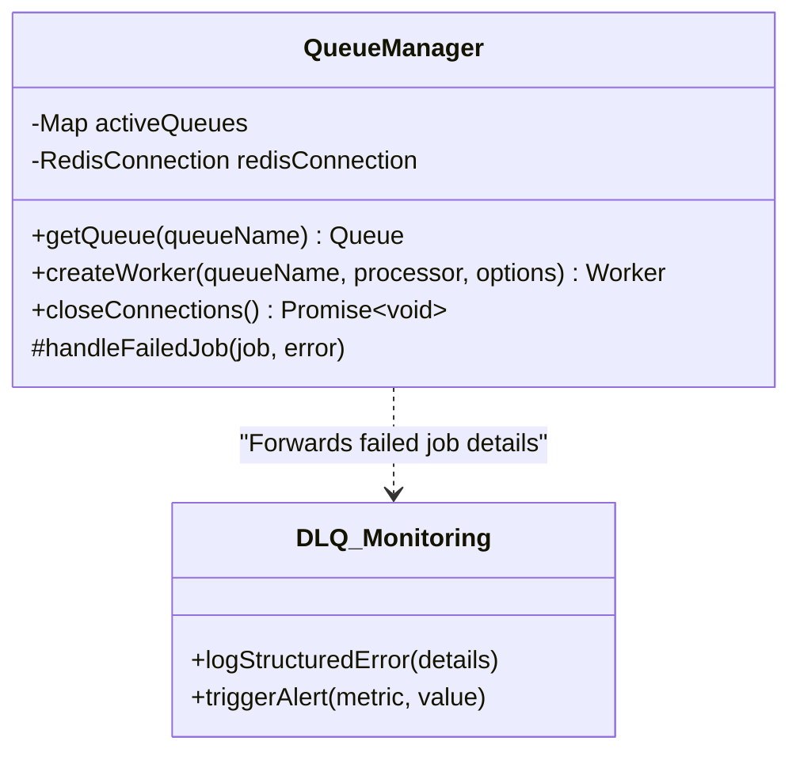

# Component Architecture-- QueueManager (Revised)

**Parent Document:** [System Architecture](./system_overview.md)
**Status:** In Design

## 1. Component Purpose (C3)

The `QueueManager` is a singleton utility responsible for creating, managing, and providing access to all BullMQ queue and worker instances. It centralizes queue configuration, ensuring consistent policies for job retries, logging, and connection management.

**This revised design enhances its role to include a robust operational strategy for the Dead-Letter Queue (DLQ), turning it from a passive receptacle into an actively managed component.**

## 2. Key Responsibilities

-   **Queue Instantiation:** Provides a `getQueue(queueName)` method that returns a singleton `Queue` instance.
-   **Worker Creation:** Provides a `createWorker(...)` method that abstracts `Worker` creation. **This no longer accepts a `concurrency` setting, as scaling is now process-based.**
-   **Connection Management:** Manages a shared Redis connection.
-   **Graceful Shutdown:** Provides a `closeConnections()` method.
-   **Dead-Letter Queue (DLQ) Management:** Implements the strategy for handling jobs that have permanently failed.

## 3. Component Diagram & Interactions

## 4. Key Functions (Revised)

### `getQueue(queueName)`
-   **Pseudocode Logic:**
    -   Checks an internal map for an existing queue instance.
    -   If not found, creates a new BullMQ `Queue` instance with default job options.
    -   **Crucially, attaches a global `failed` event listener that calls its own `_handleFailedJob` method.** This listener is attached to every queue *except* the `failed-jobs` queue itself to prevent infinite loops.
    -   Stores and returns the queue.
-   **Architectural Significance:** Centralizes the primary failure-capture mechanism for the entire system.

### `createWorker(queueName, processor, options)`
-   **Pseudocode Logic:**
    -   Merges standard configuration with caller-provided `options`.
    -   **The `concurrency` option is now ignored or deprecated.** Each worker process is expected to have a small, fixed concurrency (e.g., 1-4), and scaling is achieved by running more processes.
    -   Instantiates and returns a new BullMQ `Worker`.
-   **Architectural Significance:** Enforces the shift from in-process concurrency to a more robust, horizontally scalable, process-based scaling model.

### `_handleFailedJob(job, error)` (New Internal Method)
-   **Pseudocode Logic:**
    1.  **Log Structurally:** Gathers comprehensive details about the failure-- `job.id`, `job.name`, `job.data`, `error.message`, `error.stack`, and the worker ID. It logs this as a single structured JSON object to the console or a logging service.
    2.  **Move to DLQ:** Adds the failed job's data and the error details to the dedicated `failed-jobs` queue.
    3.  **Trigger Alerts:** Checks the current size of the `failed-jobs` queue. If it exceeds a predefined threshold (e.g., 100), it triggers an alert (e.g., email, Slack notification) to notify operators of a potential systemic issue.
-   **Architectural Significance:** This implements the core of the "Dead-Letter Black Hole" solution. It provides the **observability** (structured logs), **persistence** (moving to DLQ), and **proactive alerting** needed for a robust operational strategy. It makes failures visible and actionable.

---

## 5. Navigation

-   [Back to System Overview](./system_overview.md)