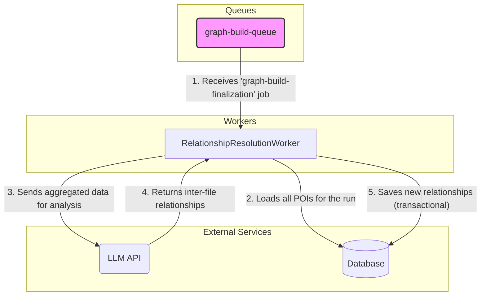

# Component Architecture-- RelationshipResolutionWorker

**Parent Document:** [System Architecture](./system_overview.md)
**Status:** In Design

## 1. Component Purpose (C3)

The `RelationshipResolutionWorker` is a specialized **consumer** that executes the final, cross-cutting analysis step. It is triggered by the `graph-build-finalization` job, which only becomes available after all `analyze-file` jobs for a given run are complete. This worker's primary function is to load all the previously analyzed data for a run, query an LLM to discover inter-file relationships, and save those new relationships to the database.

## 2. Key Responsibilities

-   **Job Consumption:** Listens to the `graph-build-queue` for `graph-build-finalization` jobs.
-   **Data Aggregation:** Loads all POIs associated with a specific `runId` from the database.
-   **Inter-file Analysis:** Constructs a prompt with the aggregated data and queries an LLM to identify relationships that span across multiple files.
-   **Data Persistence:** Saves the newly discovered inter-file relationships to the database within a transaction.
-   **Pipeline Continuation (Future):** Triggers the next step in a larger pipeline (e.g., a full graph build), though this is a placeholder in the current design.

## 3. Component Diagram & Interactions

## 4. Key Functions (from Pseudocode)

### `constructor(concurrency)`
-   **Pseudocode Logic:**
    -   Initializes the worker, setting its concurrency.
    -   Uses `QueueManager.getQueue('graph-build-queue')` to get a handle for potentially triggering future pipeline steps.
    -   Uses `QueueManager.createWorker()` to create the BullMQ worker that listens to the `relationship-resolution-queue` (Note: The parent job is on `graph-build-queue`, which then creates a job for this worker on `relationship-resolution-queue`).
-   **Architectural Significance:** Follows the same pattern of dependency injection as the other components, relying on `QueueManager` for its setup.

### `processJob(job)`
-   **Pseudocode Logic:**
    1.  Validates the job payload for a `batchId` or `runId`.
    2.  **Starts a database transaction.**
    3.  Calls a helper (`_loadAnalysisResults`) to fetch all POIs for the given ID from the database.
    4.  If no results are found, it commits the empty transaction and exits gracefully.
    5.  Calls `_resolveRelationships()` with the aggregated data, which queries the LLM.
    6.  Calls `_saveRelationships()` to persist the new inter-file relationships, passing the active transaction.
    7.  Optionally calls `_triggerPartialGraphBuild()` to enqueue the next job in the pipeline.
    8.  **Commits the transaction** if all steps succeed.
    9.  **Rolls back the transaction** on any error.
    10. Releases the database connection in a `finally` block.
-   **Architectural Significance:** This function represents another critical transactional boundary. It ensures that the discovery and saving of inter-file relationships is an all-or-nothing operation, preventing an inconsistent graph state.

### `_resolveRelationships(analysisResultsBatch)`
-   **Pseudocode Logic:**
    -   Aggregates the context from the batch of analysis results into a single, comprehensive block of text.
    -   Constructs a prompt for the LLM, specifically asking it to find connections *between* the provided file contexts.
    -   Queries the LLM and sanitizes the JSON response.
-   **Architectural Significance:** This is the core "synthesis" step of the architecture, where the system moves from individual file knowledge to a more holistic, project-wide understanding.

### `_saveRelationships(relationshipResults, transaction)`
-   **Pseudocode Logic:**
    -   Accepts the discovered relationships and the active transaction.
    -   Uses idempotent `MERGE` queries to create the relationship nodes and edges in the graph database (Neo4j).
    -   Operates entirely within the provided transaction.
-   **Architectural Significance:** Ensures that even if this final step is retried, it will not create duplicate relationship data in the knowledge graph.

---

## 5. Navigation

-   [Back to System Overview](./system_overview.md)