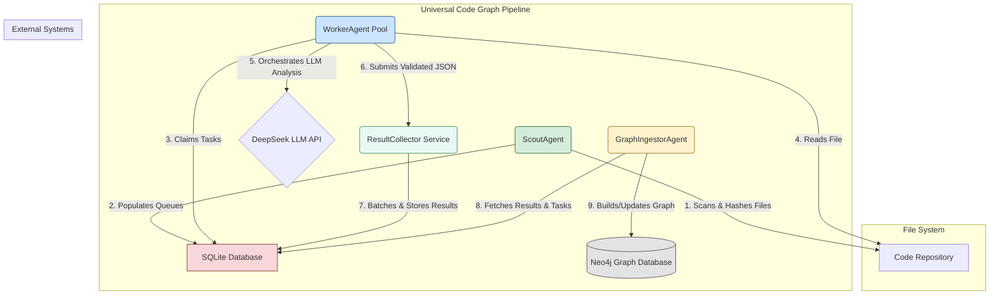

# System Architecture Overview -- Universal Code Graph V4

## 1. High-Level Architecture (C4 Model -- Context Diagram)

This document provides a high-level overview of the Universal Code Graph V4 system architecture. The system is designed as a deterministic, scalable pipeline. It is composed of distinct, decoupled agents that communicate through a central SQLite database and a dedicated `ResultCollector` service to mitigate database contention.

This revised architecture directly addresses the bottleneck risks identified in the **Devil's Advocate Review**.

## 2. System Components & Flow

The pipeline is a sequence of operations performed by specialized agents. The `SQLite Database` acts as the work queue, while the `ResultCollector` manages the high-volume ingestion of analysis results.

1.  **ScoutAgent (File Discovery)**
    *   **Responsibility**: To scan the target `Code Repository`, identify new, modified, deleted, and renamed files, and populate the work queues in the `SQLite Database`.
    *   **Trigger**: Manual or scheduled execution.
    *   **Output**: New records in the `work_queue` and `refactoring_tasks` tables in SQLite.

2.  **WorkerAgent Pool (LLM Analysis)**
    *   **Responsibility**: A pool of concurrent, stateless workers that claim file analysis tasks from the `work_queue`. Each worker reads the file content, sends it to the `DeepSeek LLM API` for analysis, performs a robust **validation and repair cycle**, and submits the resulting structured JSON to the `ResultCollector Service`.
    *   **Trigger**: Always-on, polling the `work_queue` for pending tasks.
    *   **Key Interaction**: This is the only component that communicates with the external `DeepSeek LLM API`. It is designed for horizontal scalability.

3.  **ResultCollector Service (Write Contention Mitigation)**
    *   **Responsibility**: A single, highly-available service whose sole purpose is to receive analysis results from the `WorkerAgent Pool`. It batches these results and performs bulk inserts into the `analysis_results` table in SQLite.
    *   **Trigger**: Always-on, listening for submissions from workers.
    *   **Key Feature**: This service transforms the N-to-1 write contention problem from many workers into a 1-to-1 write pattern, which SQLite can handle with maximum efficiency.

4.  **GraphIngestorAgent (Graph Building)**
    *   **Responsibility**: To periodically run as a batch job, fetching all pending analysis results and refactoring tasks from the `SQLite Database`. It then translates these into a series of Cypher queries and executes them within a single transaction to deterministically build or update the `Neo4j Graph Database`.
    *   **Trigger**: Runs on a scheduled interval.
    *   **Key Feature**: The transactional, multi-pass ingestion process ensures graph consistency.

5.  **SQLite Database (Central Hub)**
    *   **Role**: Acts as the decoupled communication layer. It stores the state of the pipeline, including work to be done (`work_queue`), analysis results (`analysis_results`), structural changes (`refactoring_tasks`), and processing failures (`failed_work`).
    *   **Technology**: A single file-based database running in WAL (Write-Ahead Logging) mode.

5.  **Neo4j Graph Database (Final Output)**
    *   **Role**: The final, persistent knowledge graph. It stores the rich, interconnected model of the codebase, ready for querying and analysis.

## 3. Architectural Goals Alignment

This architecture directly supports the primary goals outlined in the [`ProjectMasterPlan.md`](../ProjectMasterPlan.md)--

*   **LLM-Centric**: The `WorkerAgent` is the sole component responsible for code analysis via the LLM, with no reliance on traditional parsers.
*   **Decoupling**: The three agents are architecturally separate and only communicate indirectly through the database, allowing them to be developed, deployed, and scaled independently.
*   **Scalability**: The `WorkerAgent` pool can be scaled horizontally to increase analysis throughput, and the batch-based `GraphIngestorAgent` can handle large volumes of data efficiently.
*   **Resilience**: The introduction of a `failed_work` table (dead-letter queue) isolates problematic files, preventing them from halting the entire pipeline. The transactional nature of the database interactions ensures data consistency.