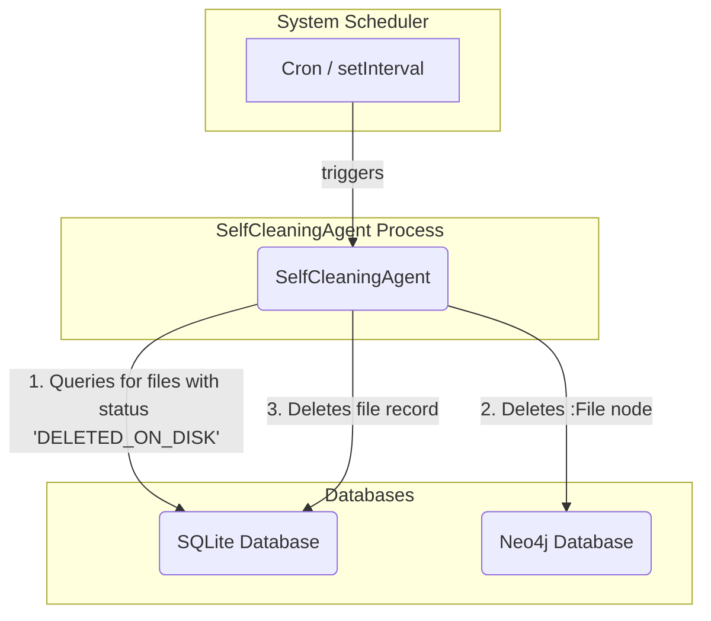

# Specification-- SelfCleaningAgent (Revised)

## 1. Overview

The `SelfCleaningAgent` is a standalone, scheduled service responsible for maintaining data integrity by removing stale records from the SQLite and Neo4j databases. This revised specification adopts the "Database-Centric Auditor" architecture, a simpler and more robust approach that eliminates the complexities and race conditions of the previous event-driven model.

The agent's core responsibility is to act upon a specific status-- `DELETED_ON_DISK`. It is a batch process, not a real-time watcher. It assumes that a separate file-watching mechanism (e.g., as part of the `EntityScout` agent's file discovery process) is responsible for monitoring the file system and updating the status of deleted files to `DELETED_ON_DISK` in the `files` table.

This agent ensures that the system's knowledge base eventually reflects the state of the file system without requiring complex real-time synchronization infrastructure.

## 2. Architecture

The agent's architecture is a simple, scheduled batch process that interacts directly with the databases.

1.  **Scheduler**: A standard scheduling mechanism (e.g., cron, `setInterval` in Node.js) invokes the agent's `run` method periodically.
2.  **`SelfCleaningAgent`**: The agent queries the SQLite database for files marked for deletion.
3.  **Database Cleanup**: For each marked file, the agent first removes its representation from the Neo4j graph database and then removes its record from the SQLite database.



## 3. Data Model Requirements

This agent relies on an update to the `files` table schema in the SQLite database.

-   **Table**: `files`
-   **Column**: `status`
-   **New Enum Value**: A new status, `'DELETED_ON_DISK'`, MUST be added to the list of possible statuses.

**File Status Lifecycle Change**:
1.  A file is created -> `status: 'pending'` (Handled by `EntityScout`).
2.  A file is processed -> `status: 'processed'` (Handled by `GraphBuilder`).
3.  A file is modified -> `status: 'pending'` (Handled by `EntityScout`).
4.  **A file is deleted on disk** -> `status: 'DELETED_ON_DISK'` (Handled by `EntityScout`/File Watcher).
5.  **`SelfCleaningAgent` runs** -> Deletes the record from SQLite and the node from Neo4j.

## 4. Functional Requirements

-   The agent MUST be able to run as a scheduled, periodic process.
-   On each run, the agent MUST query the `files` table for all records where `status = 'DELETED_ON_DISK'`.
-   For each file record retrieved, the agent MUST perform the following actions in order:
    1.  Execute a `DETACH DELETE` query in Neo4j to remove the corresponding `:File` node and all its relationships. The node is identified by its `path` property.
    2.  Only after the Neo4j deletion is successful, execute a `DELETE` query in SQLite to remove the file record from the `files` table.
-   The cleanup process for each file MUST be atomic. If the Neo4j deletion fails, the SQLite record MUST NOT be deleted, and the error should be logged.
-   All database operations MUST be idempotent. Attempting to delete a record that has already been deleted should not cause an error.

## 5. Class and Function Definitions

### 5.1. `SelfCleaningAgent` Class

A class that encapsulates the cleanup logic.

-   **Properties**:
    -   `sqliteDb` (Object)-- An instance of the SQLite database connection client.
    -   `neo4jDriver` (Object)-- An instance of the Neo4j driver.
-   **Methods**:
    -   `constructor(dbClient: object, graphClient: object)`
        -   **Purpose**: Initializes the agent with database connections.
    -   `run()`: `Promise<void>`
        -   **Purpose**: The main entry point for the agent's execution cycle. It orchestrates the entire cleanup process.
        -   **TDD Anchor/Pseudocode Stub**:
            ```
            TEST 'run should process all files marked as DELETED_ON_DISK'
            TEST 'run should not delete SQLite record if Neo4j deletion fails'
            FUNCTION run()
              deletedFiles = CALL _findDeletedFiles()
              FOR each file in deletedFiles
                TRY
                  CALL _cleanNeo4jNode(file.file_path)
                  CALL _cleanSqliteRecord(file.file_path)
                  LOG `Successfully cleaned up ${file.file_path}`
                CATCH error
                  LOG_ERROR `Failed to clean up ${file.file_path}: ${error.message}`
                END TRY
              END FOR
            END FUNCTION
            ```
    -   `_findDeletedFiles()`: `Promise<Array<object>>`
        -   **Purpose**: Queries the SQLite database for all files that need to be cleaned up.
        -   **Returns**: A promise that resolves to an array of file objects (e.g., `[{ file_path: 'path/to/file.js' }]`).
        -   **TDD Anchor/Pseudocode Stub**:
            ```
            TEST '_findDeletedFiles should return records with status DELETED_ON_DISK'
            FUNCTION _findDeletedFiles()
              query = "SELECT file_path FROM files WHERE status = 'DELETED_ON_DISK'"
              RETURN sqliteDb.query(query)
            END FUNCTION
            ```
    -   `_cleanNeo4jNode(filePath: string)`: `Promise<void>`
        -   **Purpose**: Deletes the corresponding `:File` node from Neo4j.
        -   **Parameters**:
            -   `filePath`: The path of the file to remove from Neo4j.
        -   **TDD Anchor/Pseudocode Stub**:
            ```
            TEST '_cleanNeo4jNode should execute a DETACH DELETE query'
            FUNCTION _cleanNeo4jNode(filePath)
              session = neo4jDriver.session()
              query = "MATCH (f:File {path: $filePath}) DETACH DELETE f"
              TRY
                session.run(query, { filePath: filePath })
              FINALLY
                session.close()
              END TRY
            END FUNCTION
            ```
    -   `_cleanSqliteRecord(filePath: string)`: `Promise<void>`
        -   **Purpose**: Deletes the file record from the SQLite `files` table.
        -   **Parameters**:
            -   `filePath`: The path of the file to remove from SQLite.
        -   **TDD Anchor/Pseudocode Stub**:
            ```
            TEST '_cleanSqliteRecord should execute a DELETE query on the files table'
            FUNCTION _cleanSqliteRecord(filePath)
              query = "DELETE FROM files WHERE file_path = ?"
              sqliteDb.run(query, filePath)
            END FUNCTION
            ```

## 6. Non-Functional Requirements

-   **Robustness**: The agent must gracefully handle and log database connection errors or query failures without crashing.
-   **Efficiency**: Database queries should be indexed (`file_path` and `status` columns) to ensure the cleanup process is fast and has a low impact on database performance.
-   **Simplicity**: The agent's logic is intentionally simple, focused solely on cleanup. It has no file-watching or complex state management responsibilities.

## 7. Edge Cases and Constraints

-   **Agent Failure**: If the agent process fails mid-run, it will simply attempt the same cleanup operation on its next scheduled run. The idempotency of the database operations ensures this is safe.
-   **Dependency**: This agent's correct functioning is entirely dependent on another process correctly identifying deleted files and updating their status to `DELETED_ON_DISK`. If that process fails, this agent will have no work to do.
-   **Orphaned Records**: If the `ON DELETE CASCADE` constraint recommended in the critique is not implemented in the SQLite schema, this agent's `DELETE` operation could leave orphaned records in `points_of_interest` and `resolved_relationships`. This specification assumes the schema will be strengthened to prevent this.